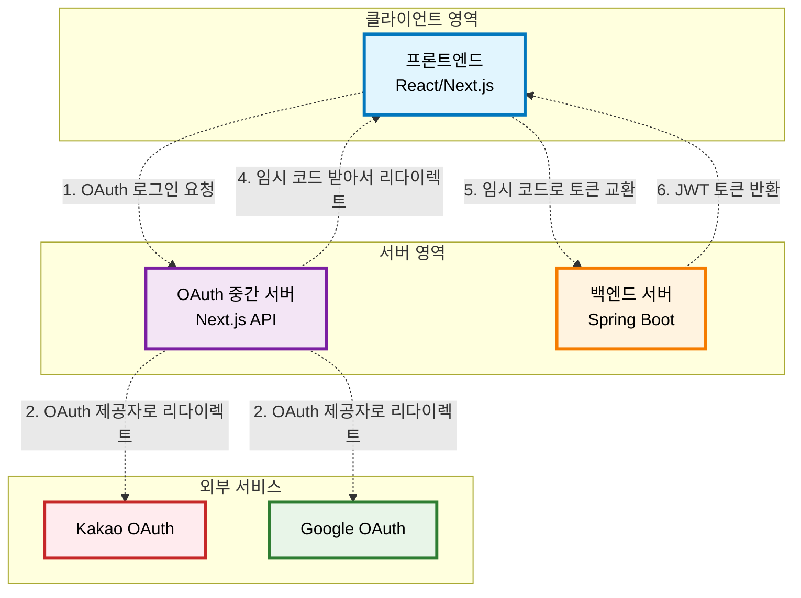
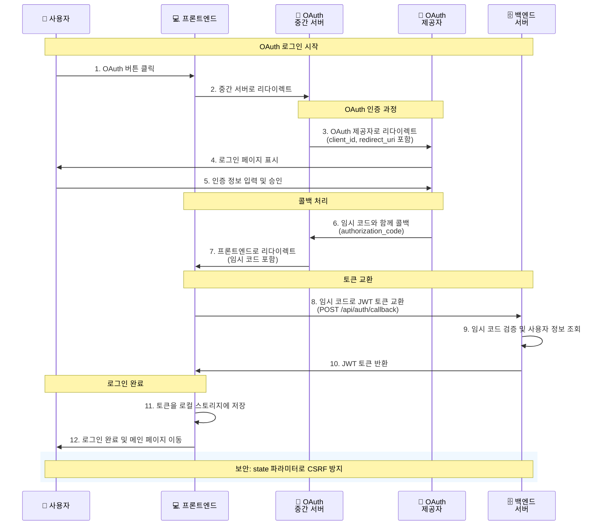
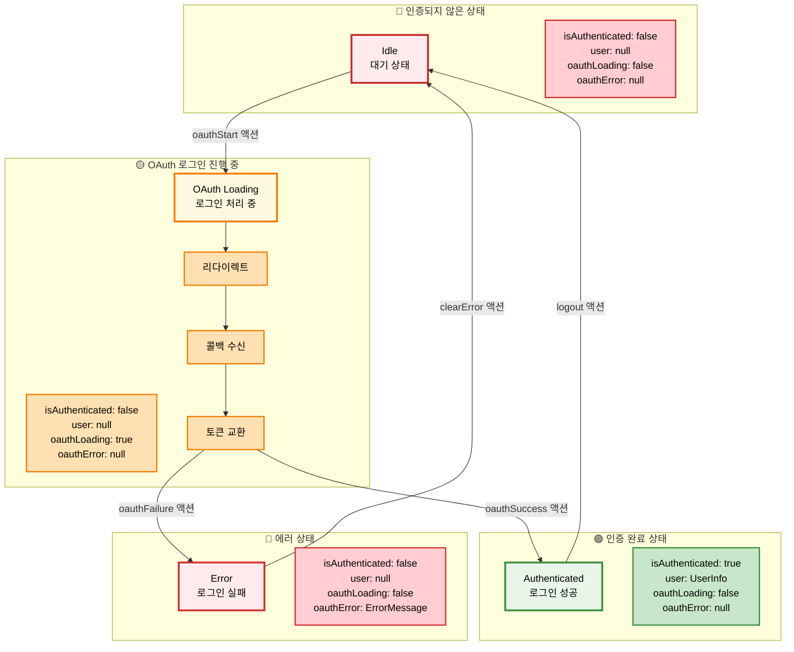
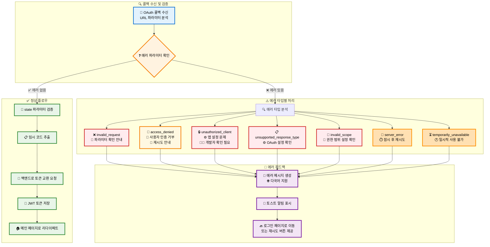

# OAuth 프론트엔드 구현 가이드


## 개요

이 프로젝트는 OAuth 2.0 기반의 소셜 로그인 기능을 구현하고 있습니다. Kakao와 Google OAuth 제공자를 지원하며, 중간 서버를 통한 안전한 인증 플로우를 사용합니다.

## 목차

- [개요](#개요)
- [지원 OAuth 제공자](#지원-oauth-제공자)
- [아키텍처](#아키텍처)
- [파일 구조](#파일-구조)
- [주요 컴포넌트](#주요-컴포넌트)
- [타입 정의](#타입-정의)
- [상태 관리](#상태-관리)
- [환경 변수](#환경-변수)
- [API 엔드포인트](#api-엔드포인트)
- [다국어 지원](#다국어-지원)
- [보안 고려사항](#보안-고려사항)
- [에러 처리](#에러-처리)
- [참고 자료](#참고-자료)

## 지원 OAuth 제공자

- **Kakao**: 카카오 로그인
- **Google**: 구글 로그인

## 아키텍처



### 인증 플로우



## 파일 구조

### 핵심 파일들

```
vans_story_be/src/main/kotlin/blog/vans_story_be/
├─ VansStoryBeApplication.kt             # 메인 애플리케이션
├─ domain/
│  ├─ user/
│  │  ├─ controller/UserController.kt    # 사용자 CRUD API
│  │  ├─ service/UserService.kt          # 사용자 비즈니스 로직
│  │  ├─ repository/UserRepository.kt    # Exposed DAO
│  │  ├─ entity/User.kt                  # 사용자 엔티티 + 테이블
│  │  ├─ entity/Role.kt                  # 권한 Enum
│  │  ├─ dto/UserDto.kt                  # 요청/응답 DTO
│  │  └─ mapper/UserMapper.kt            # 객체 변환
│  ├─ oauth/
│  │  ├─ controller/OAuthController.kt   # OAuth 연동 API
│  │  ├─ service/OAuthService.kt         # OAuth 비즈니스 로직
│  │  ├─ repository/UserOAuthRepository.kt # OAuth 데이터 접근
│  │  ├─ entity/UserOAuth.kt             # OAuth 연동 엔티티
│  │  ├─ dto/OAuthDto.kt                 # OAuth DTO
│  │  └─ mapper/OAuthMapper.kt           # OAuth 객체 변환
│  ├─ auth/
│  │  ├─ controller/AuthController.kt    # JWT 인증 API
│  │  ├─ service/AuthService.kt          # JWT 토큰 관리
│  │  ├─ jwt/JwtTokenProvider.kt         # JWT 토큰 생성/검증
│  │  ├─ annotation/RequireApiKey.kt     # API 키 인증 어노테이션
│  │  ├─ aspect/ApiKeyAspect.kt          # API 키 검증 AOP
│  │  └─ dto/AuthDto.kt                  # 인증 DTO
│  └─ base/BaseEntity.kt                 # 공통 엔티티
├─ config/
│  ├─ security/SecurityConfig.kt         # Spring Security 설정
│  ├─ security/CustomUserDetailsService.kt # 사용자 인증 서비스
│  ├─ database/DatabaseConfig.kt         # Exposed ORM 설정
│  ├─ cors/CorsConfig.kt                 # CORS 정책
│  ├─ swagger/SwaggerConfig.kt           # API 문서화 설정
│  ├─ apiLogger/ApiLoggerConfig.kt       # API 로깅 설정
│  └─ init/DataInitializer.kt            # 초기 데이터 설정
├─ global/
│  ├─ response/ApiResponse.kt            # 통합 응답 형식
│  ├─ exception/CustomException.kt       # 사용자 정의 예외
│  └─ mapper/GlobalMapper.kt             # 전역 객체 변환
└─ post/                                 # 포스트 관련 (별도 기능)
```

## 주요 컴포넌트

### 1. OAuth 유틸리티 (src/utils/oauth.ts)

OAuth 관련 유틸리티 함수들을 제공합니다.

#### 주요 함수

- `generateState()`: OAuth 상태 파라미터 생성
- `validateState()`: OAuth 상태 파라미터 검증
- `extractCallbackData()`: URL 파라미터에서 콜백 데이터 추출 (Query Parameter 방식)
- `extractCallbackDataFromFragment()`: Fragment에서 콜백 데이터 추출 (Fragment 방식)
- `extractCallbackDataUnified()`: Query Parameter + Fragment 방식 통합 처리
- `getProviderDisplayName()`: 제공자 표시명 반환
- `getErrorMessage()`: 에러 메시지 생성
- `buildRedirectUrl()`: 리다이렉트 URL 생성
- `buildFragmentRedirectUrl()`: Fragment 방식 리다이렉트 URL 생성
- `buildOAuthUrl()`: OAuth 중간 서버 URL 생성

### 2. 인증 서비스 (src/components/features/auth/authService.ts)

OAuth 로그인 및 계정 관리 기능을 제공합니다.

#### 주요 함수

- `kakaoLogin()`: 카카오 로그인 시작
- `googleLogin()`: 구글 로그인 시작
- `exchangeCodeForToken()`: 임시 코드를 JWT 토큰으로 교환
- `unlinkOAuthAccount()`: OAuth 계정 연결 해제
- `getLinkedOAuthAccounts()`: 연결된 OAuth 계정 목록 조회

### 3. OAuth 콜백 처리 (src/app/oauth/callback/page.tsx)

OAuth 제공자에서 리다이렉트된 사용자를 처리합니다.

#### 처리 과정

1. URL 파라미터와 Fragment에서 OAuth 콜백 데이터 추출 (`extractCallbackDataUnified` 사용)
2. 에러 체크 및 처리
3. 모드 확인 (로그인/계정연결)
4. 임시 코드를 JWT 토큰으로 교환 (로그인 모드)
5. 토큰 저장 및 로그인 상태 업데이트
6. 환영 메시지 표시 및 메인 페이지로 리다이렉트

### 4. OAuth 콜백 API (src/app/api/auth/callback/route.ts)

프론트엔드에서 받은 임시 코드를 백엔드로 전달하여 JWT 토큰을 획득합니다.

#### 처리 과정

1. 클라이언트에서 임시 코드 수신
2. 백엔드 서버로 임시 코드 전송
3. 백엔드에서 JWT 토큰 수신
4. 토큰을 클라이언트에 반환

### 5. 로그인 모달 (src/components/ui/auth/LoginModal.tsx)

OAuth 로그인 UI를 제공합니다.

#### 기능

- 카카오/구글 로그인 버튼
- 로딩 상태 표시
- 에러 메시지 표시
- 일반 로그인 폼

### 6. OAuth 계정 관리 (src/components/ui/auth/OAuthAccountManager.tsx)

연결된 OAuth 계정 관리 기능을 제공합니다.

#### 기능

- 연결된 계정 목록 표시 (`getLinkedOAuthAccounts()` 사용)
- 새로운 계정 연결 시도 (OAuth 중간 서버로 리다이렉트, 하지만 실제 연결은 미구현)
- 기존 계정 연결 해제 (`unlinkOAuthAccount()` 사용)
- 제공자별 아이콘 표시

#### 실제 동작

- **계정 연결**: `handleLinkAccount()` 함수는 OAuth 중간 서버로 리다이렉트만 합니다.
- **계정 해제**: `handleUnlinkAccount()` 함수는 실제로 `authService.unlinkOAuthAccount()`를 호출합니다.
- **계정 연결 완료**: OAuth 콜백 페이지에서 계정 연결 모드는 "아직 미구현"으로 처리됩니다.

## 타입 정의

### OAuth 제공자 타입
```typescript
export type OAuthProvider = 'kakao' | 'google';
```

### OAuth 콜백 데이터
```typescript
export interface OAuthCallbackData {
  token?: string;           // 기존 방식 (JWT 토큰)
  code?: string;            // 새로운 방식 (임시 코드)
  error?: string;
  provider?: OAuthProvider;
  state?: string;
}
```

### 연결된 OAuth 계정
```typescript
export interface LinkedOAuthAccount {
  provider: OAuthProvider;
  providerEmail?: string;
  createdAt: string;
}
```

## 상태 관리

Redux Toolkit을 사용하여 인증 상태를 관리합니다.

### 인증 상태 플로우



### 주요 상태

- `isAuthenticated`: 로그인 여부
- `user`: 사용자 정보
- `oauthLoading`: OAuth 로그인 진행 중 여부
- `oauthError`: OAuth 에러 정보

### 주요 액션

- `oauthStart`: OAuth 로그인 시작
- `oauthSuccess`: OAuth 로그인 성공
- `oauthFailure`: OAuth 로그인 실패

## 환경 변수

### 필수 환경 변수

```env
NEXT_PUBLIC_OAUTH_SERVICE_URL=http://localhost:3004
NEXT_PUBLIC_BACKEND_URL=http://localhost:8080
```

### 설정 방법

1. `.env.local` 파일을 생성합니다.
2. 위 환경 변수들을 설정합니다.
3. 각 서비스의 URL을 실제 배포 환경에 맞게 수정합니다.

## API 엔드포인트

### 백엔드 API

- `POST /api/auth/callback`: 임시 코드를 JWT 토큰으로 교환
- `GET /api/v1/oauth/accounts`: 연결된 OAuth 계정 목록 조회
- `DELETE /api/v1/oauth/unlink`: OAuth 계정 연결 해제

### OAuth 중간 서버 API

- `GET /api/auth/google/login`: 구글 로그인 시작
- `GET /api/auth/kakao/login`: 카카오 로그인 시작

## 다국어 지원

### 지원 언어

- 한국어 (ko)
- 영어 (en)

### 메시지 파일

- `src/messages/ko/auth.json`: 한국어 메시지
- `src/messages/en/auth.json`: 영어 메시지

### 사용 방법

```typescript
import { useTranslations } from 'next-intl';

const t = useTranslations('auth');
const loginButtonText = t('login.oauth.google');
```

## 보안 고려사항

### 1. State 파라미터 검증

OAuth 인증 과정에서 CSRF 공격을 방지하기 위해 state 파라미터를 사용합니다.

### 2. 토큰 안전 저장

- Access Token: 로컬 스토리지에 저장
- Refresh Token: HTTP-Only 쿠키로 관리

### 3. 중간 서버 사용

OAuth 토큰을 직접 프론트엔드에서 처리하지 않고, 중간 서버를 통해 안전하게 처리합니다.

## 에러 처리

### 에러 처리 플로우



### 주요 에러 타입

- `invalid_request`: 잘못된 요청
- `access_denied`: 사용자가 인증 거부
- `unauthorized_client`: 인증되지 않은 클라이언트
- `unsupported_response_type`: 지원하지 않는 응답 타입
- `invalid_scope`: 잘못된 권한 범위
- `server_error`: 서버 오류
- `temporarily_unavailable`: 일시적으로 사용 불가

### 에러 처리 방법

```typescript
if (error) {
  const errorMessage = getErrorMessage(error, provider);
  toast.error(errorMessage);
  return;
}
```

## 참고 자료

- [OAuth 2.0 RFC](https://tools.ietf.org/html/rfc6749)
- [Kakao 로그인 API 문서](https://developers.kakao.com/docs/latest/ko/kakaologin/rest-api)
- [Google OAuth 2.0 문서](https://developers.google.com/identity/protocols/oauth2)
- [Next.js 인증 가이드](https://nextjs.org/docs/authentication) 