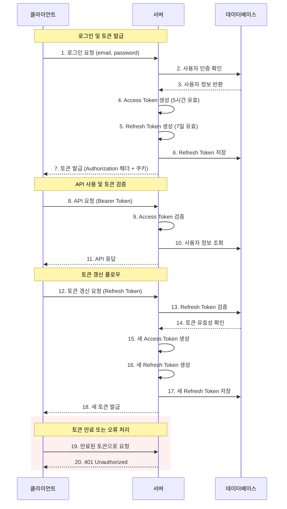
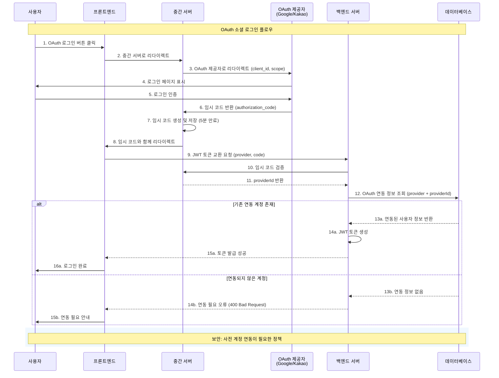
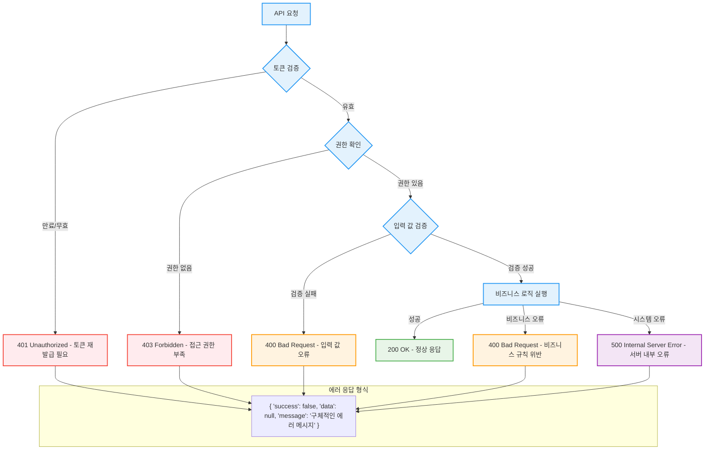

# User Service API 가이드

## 목차
- [개요](#개요)
- [아키텍처 설계](#아키텍처-설계)
- [인증 시스템](#인증-시스템)
- [OAuth 통합](#oauth-통합)
- [API 설계 원칙](#api-설계-원칙)
- [에러 처리](#에러-처리)
- [보안 고려사항](#보안-고려사항)
- [개발 가이드](#개발-가이드)

## 개요

User Service는 VansDevBlog의 사용자 인증과 권한 관리를 담당하는 핵심 백엔드 서비스입니다.

### 주요 기능
- 🔐 **사용자 인증**: 이메일/비밀번호 기반 로그인
- 🔑 **JWT 토큰 관리**: Access Token / Refresh Token 발급 및 갱신
- 🌐 **OAuth 소셜 로그인**: Google, Kakao, Naver 등 연동
- 👤 **사용자 정보 관리**: 프로필 조회 및 수정
- 🛡️ **권한 관리**: 역할 기반 접근 제어

### 기술 스택
- **언어**: Kotlin 1.9.22
- **프레임워크**: Spring Boot 3.5.0
- **ORM**: Exposed ORM 0.45.0 (JPA가 아님!)
- **데이터베이스**: MariaDB
- **보안**: Spring Security + JWT (jjwt 0.12.6)
- **문서화**: SpringDoc OpenAPI 3.0 (Swagger)
- **빌드 도구**: Gradle + Kotlin DSL
- **테스트**: Kotest + MockK
- **로깅**: kotlin-logging-jvm
- **환경 설정**: spring-dotenv

## 아키텍처 설계

### 레이어드 아키텍처

```mermaid
graph TD
    subgraph "🎯 실제 프로젝트 구조 (blog.vans_story_be)"
        A[Controller Layer<br/>📡 REST API 엔드포인트]
        A --> A1[UserController<br/>사용자 CRUD API]
        A --> A2[AuthController<br/>JWT 인증 API]
        A --> A3[OAuthController<br/>OAuth 연동 API]
    end
    
    subgraph "🏢 Service Layer"
        B["Service Layer - 🏢 비즈니스 로직"]
        B --> B1["UserService - 사용자 비즈니스 로직"]
        B --> B2["AuthService - JWT 토큰 관리"]
        B --> B3["OAuthService - OAuth 연동 로직"]
    end
    
    subgraph "🗃️ Repository Layer"
        C["Repository Layer - 🗃️ 데이터 접근 (Exposed ORM)"]
        C --> C1["UserRepository - Exposed DAO 기반"]
        C --> C2["UserOAuthRepository - OAuth 연동 데이터"]
    end
    
    subgraph "🏛️ Entity Layer"
        D["Entity Layer - 🏛️ Exposed 엔티티"]
        D --> D1["User + Users - 사용자 엔티티 + 테이블"]
        D --> D2["UserOAuth + UserOAuths - OAuth 연동 엔티티 + 테이블"]
        D --> D3["Role - 권한 Enum"]
    end
    
    subgraph "⚙️ Configuration"
        E["Config Layer - ⚙️ 설정 관리"]
        E --> E1["SecurityConfig - Spring Security"]
        E --> E2["DatabaseConfig - Exposed 설정"]
        E --> E3["CorsConfig - CORS 정책"]
        E --> E4["SwaggerConfig - API 문서화"]
    end
    
    subgraph "🌐 Global Components"
        F["Global Layer - 🌐 전역 컴포넌트"]
        F --> F1["ApiResponse - 통합 응답 형식"]
        F --> F2["CustomException - 예외 처리"]
        F --> F3["GlobalMapper - 객체 변환"]
    end
    
    A --> B
    B --> C
    C --> D
    A -.-> E
    B -.-> F
    
    classDef controllerClass fill:#e3f2fd,stroke:#1976d2,stroke-width:2px
    classDef serviceClass fill:#f3e5f5,stroke:#7b1fa2,stroke-width:2px
    classDef repositoryClass fill:#e8f5e8,stroke:#388e3c,stroke-width:2px
    classDef entityClass fill:#fff3e0,stroke:#f57c00,stroke-width:2px
    classDef configClass fill:#ffebee,stroke:#f44336,stroke-width:2px
    classDef globalClass fill:#f9f9f9,stroke:#757575,stroke-width:2px
    
    class A,A1,A2,A3 controllerClass
    class B,B1,B2,B3 serviceClass
    class C,C1,C2 repositoryClass
    class D,D1,D2,D3 entityClass
    class E,E1,E2,E3,E4 configClass
    class F,F1,F2,F3 globalClass
```



### 도메인 모델
- **User**: 사용자 정보 (이메일, 비밀번호, 프로필)
- **OAuthAccount**: OAuth 계정 연동 정보
- **Role**: 사용자 권한 (ADMIN, USER)
- **RefreshToken**: 토큰 갱신을 위한 정보

## 인증 시스템

### JWT 토큰 전략
User Service는 이중 토큰 전략을 사용합니다:

#### Access Token
- **용도**: API 요청 인증
- **전송 방식**: Authorization Bearer 헤더
- **만료 시간**: 5시간 (18000초)
- **저장 위치**: 클라이언트 메모리 (보안)

#### Refresh Token
- **용도**: Access Token 갱신
- **전송 방식**: HTTP-Only 쿠키
- **만료 시간**: 7일 (604800초)
- **저장 위치**: 서버 데이터베이스 + 클라이언트 쿠키

### 인증 플로우
```
1. 사용자 로그인 → 2. 토큰 발급 → 3. API 요청 → 4. 토큰 검증
     ↓                    ↓                ↓               ↓
5. 토큰 만료 → 6. 갱신 요청 → 7. 새 토큰 발급 → 8. 계속 사용
```



## OAuth 통합

### 지원 제공업체
- **Google**: Google OAuth 2.0
- **Kakao**: Kakao Login API

### OAuth 보안 정책
- **연동 우선**: 기존 계정에 OAuth 연동만 가능
- **자동 가입 불가**: 새로운 OAuth 계정으로 자동 가입 미지원
- **임시 코드 시스템**: OAuth 로그인 → 임시 코드 → JWT 토큰 교환

### OAuth 플로우
```
1. OAuth 로그인 → 2. 임시 코드 발급 → 3. 코드 교환 → 4. JWT 토큰 발급
   (5분 만료)         (providerId 확인)      (실제 인증)      (정상 사용)
```



## API 설계 원칙

### RESTful 설계
- **리소스 중심**: `/users`, `/oauth`, `/auth`
- **HTTP 메서드**: GET, POST, PUT, DELETE 적절히 활용
- **상태 코드**: 200, 201, 204, 400, 401, 403, 500 등

### 일관된 응답 형식
모든 API는 다음 형식을 따릅니다:
```json
{
  "success": boolean,
  "data": object | null,
  "message": string | null
}
```

### 버전 관리
- **URL 경로**: `/api/v1/...`
- **하위 호환성**: 기존 API 유지
- **점진적 업그레이드**: 새 버전 병렬 운영

## 에러 처리

### 표준화된 에러 응답
```json
{
  "success": false,
  "data": null,
  "message": "구체적인 에러 메시지"
}
```

### 주요 에러 카테고리
- **인증 에러** (401): 토큰 만료, 잘못된 인증 정보
- **권한 에러** (403): 접근 권한 부족
- **검증 에러** (400): 입력 값 검증 실패
- **서버 에러** (500): 내부 서버 오류



## 보안 고려사항

### 토큰 보안
- **HTTP-Only 쿠키**: Refresh Token XSS 공격 방지
- **Secure 플래그**: HTTPS 환경에서만 쿠키 전송
- **SameSite 속성**: CSRF 공격 방지

### 비밀번호 보안
- **bcrypt 해싱**: 안전한 비밀번호 저장
- **복잡성 검증**: 8자 이상, 영문/숫자/특수문자 조합
- **브루트 포스 방지**: 로그인 시도 제한

### CORS 설정
- **허용 오리진**: 특정 도메인만 허용
- **자격 증명 포함**: 쿠키 전송 허용
- **허용 메서드**: GET, POST, PUT, DELETE

---

## 📋 상세 API 명세

구체적인 API 엔드포인트, 요청/응답 형식, 파라미터 등은 **[Swagger API 문서](./user-swagger/)** 를 참조하세요.

Swagger UI에서 다음 기능을 사용할 수 있습니다:
- 📖 전체 API 목록 및 상세 설명
- 📝 요청/응답 예시
- 🔍 스키마 정의 확인 