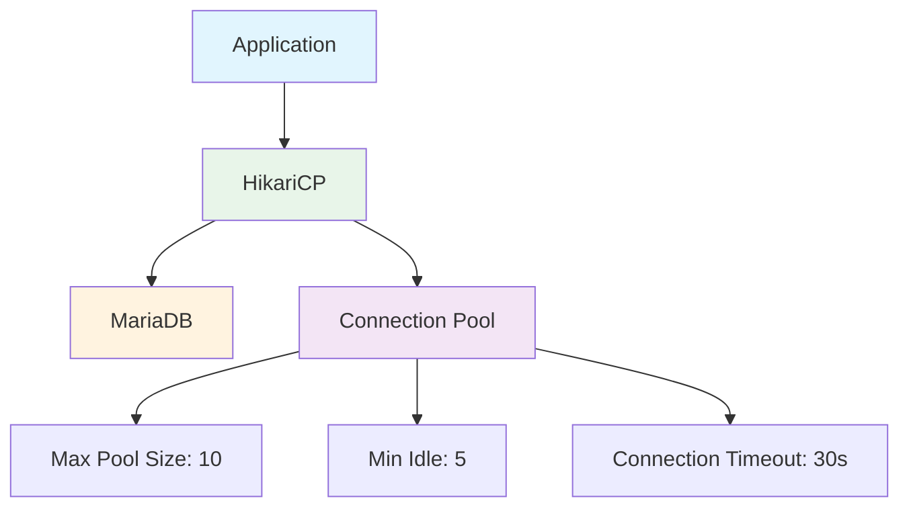
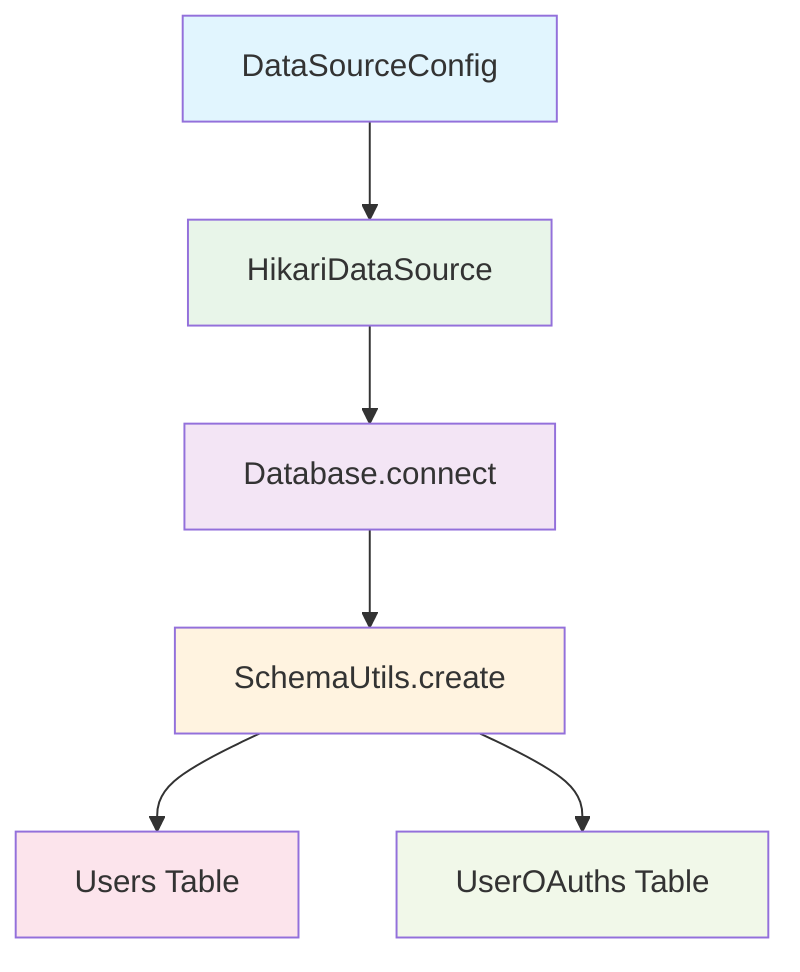
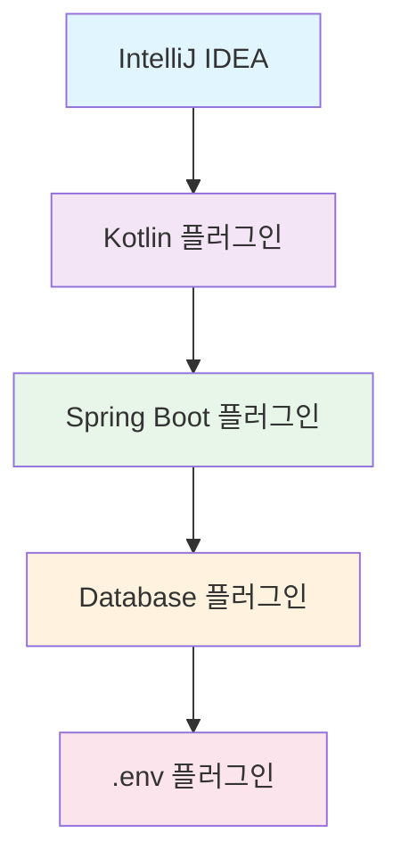
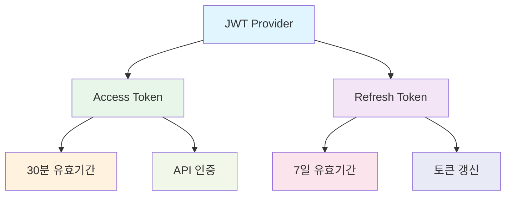
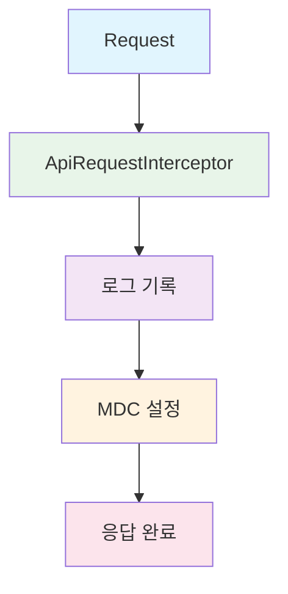
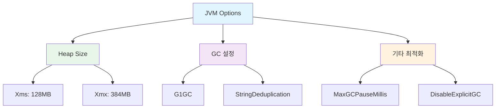
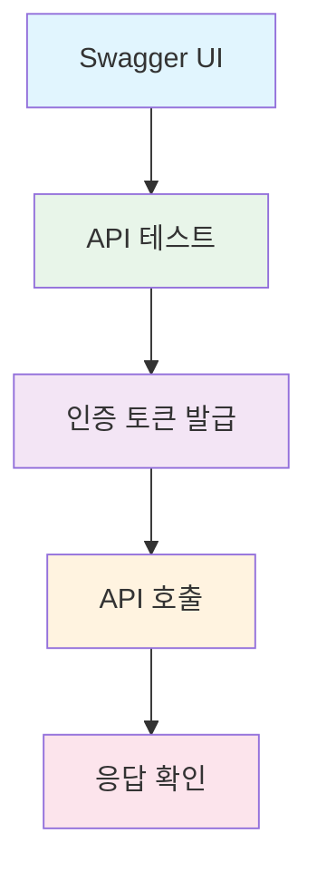

# 📋 User Service 개발 가이드

## 🚀 개발 환경 구성

### 1. 필수 요구사항

| 분류 | 기술/도구 | 버전 |
|:---:|:---:|:---:|
|Runtime | Java | 21 |
|Framework | Spring Boot | 3.5.0 |
|Language | Kotlin | 1.9.22 |
|Database | MariaDB | 10.x |
|IDE | IntelliJ IDEA | Latest |

### 2. 프로젝트 구조

```
vans_story_be/
├── src/
│   ├── main/
│   │   ├── kotlin/
│   │   │   └── blog/vans_story_be/
│   │   │       ├── config/          # 설정 파일들
│   │   │       │   ├── database/    # 데이터베이스 설정
│   │   │       │   ├── security/    # 보안 설정
│   │   │       │   └── cors/        # CORS 설정
│   │   │       ├── domain/          # 도메인 별 패키지
│   │   │       │   ├── user/        # 사용자 관리
│   │   │       │   ├── auth/        # 인증/인가
│   │   │       │   └── oauth/       # OAuth 연동
│   │   │       └── global/          # 전역 설정
│   │   └── resources/
│   │       ├── application.yaml     # 메인 설정
│   │       └── application-prod.yaml # 운영환경 설정
│   └── test/
│       ├── kotlin/                  # 테스트 코드
│       └── resources/
│           └── application-test.yaml # 테스트 설정
├── build.gradle                     # 빌드 설정
└── .env                            # 환경변수 (로컬)
```

---

## 💾 데이터베이스 설정

### 1. MariaDB 연결 설정



**환경변수 설정 (.env 파일)**
```bash
# 데이터베이스 연결 정보
VANS_BLOG_DB_HOST=localhost
VANS_BLOG_DB_PORT=3306
VANS_BLOG_DB_NAME=devblog
VANS_BLOG_DB_USERNAME=root
VANS_BLOG_DB_PASSWORD=your_password

# 관리자 계정 (초기 데이터)
VANS_BLOG_ADMIN_USERNAME=admin
VANS_BLOG_ADMIN_PASSWORD=admin1234!
VANS_BLOG_ADMIN_EMAIL=admin@vans-story.com

# 테스트 계정 (초기 데이터)
VANS_BLOG_TEST_USERNAME=testuser
VANS_BLOG_TEST_PASSWORD=Test1234!
VANS_BLOG_TEST_EMAIL=test@vans-story.com
```

### 2. Exposed ORM 설정



**테이블 자동 생성 설정**
```kotlin
// DataSourceConfig.kt
@EventListener(ApplicationReadyEvent::class)
fun createTables() {
    Database.connect(dataSource())
    transaction {
        SchemaUtils.create(Users, UserOAuths)
    }
}
```

### 3. 테스트 데이터베이스 (H2)

```yaml
# application-test.yaml
spring:
  datasource:
    driver-class-name: org.h2.Driver
    url: jdbc:h2:mem:testdb;MODE=MySQL;DB_CLOSE_DELAY=-1
    username: sa
    password:
```

---

## 🔧 개발 환경 실행

### 1. 로컬 개발 환경 실행

```bash
# 1. 프로젝트 클론 및 이동
git clone <repository-url>
cd vans_story_be

# 2. 환경변수 파일 생성
cp .env.example .env
# .env 파일 내용 수정

# 3. 데이터베이스 실행 (Docker)
docker run -d \
  --name mariadb \
  -e MYSQL_ROOT_PASSWORD=your_password \
  -e MYSQL_DATABASE=devblog \
  -p 3306:3306 \
  mariadb:10

# 4. 애플리케이션 실행
./gradlew bootRun
```

### 2. IDE 설정 (IntelliJ IDEA)



**실행 구성 설정**
- Main class: `blog.vans_story_be.VansStoryBeApplicationKt`
- VM options: `-Dspring.profiles.active=dev`
- Environment variables: `.env` 파일 내용

### 3. 테스트 실행

```bash
# 전체 테스트 실행
./gradlew test

# 특정 테스트 실행
./gradlew test --tests "blog.vans_story_be.domain.auth.*"

# 테스트 커버리지 확인
./gradlew test jacocoTestReport
```

---

## 🔐 보안 설정

### 1. JWT 설정



**JWT 환경변수**
```bash
# JWT 설정
JWT_SECRET=your-secret-key-minimum-32-characters
JWT_ACCESS_TOKEN_VALIDITY=1800      # 30분
JWT_REFRESH_TOKEN_VALIDITY=604800   # 7일
```

### 2. CORS 설정

```bash
# CORS 허용 도메인 (쉼표로 구분)
CORS_ALLOWED_ORIGINS=http://localhost:3000,http://localhost:5173,https://vans-story.com
```

### 3. 비밀번호 암호화

```kotlin
// BCrypt 사용
@Bean
fun passwordEncoder(): PasswordEncoder = BCryptPasswordEncoder()
```

---

## 📊 모니터링 및 로깅

### 1. 로깅 설정



**로그 레벨 설정**
```yaml
logging:
  level:
    blog.vans_story_be: DEBUG        # 개발환경
    org.springframework.security: INFO
    org.hibernate.SQL: DEBUG
```

### 2. 성능 모니터링

```bash
# JVM 메모리 모니터링
LOG_LEVEL=DEBUG ./gradlew bootRun

# 데이터베이스 쿼리 로그
SHOW_SQL=true ./gradlew bootRun
```

---

## 🚀 배포 설정

### 1. 프로덕션 빌드

```bash
# JAR 파일 생성
./gradlew bootJar

# 빌드 결과물 확인
ls -la build/libs/vans-story-be.jar
```

### 2. 메모리 최적화 (512MB 환경)



**JVM 옵션 설정**
```bash
java -Xms128m -Xmx384m \
     -XX:+UseG1GC \
     -XX:+UseStringDeduplication \
     -XX:MaxGCPauseMillis=200 \
     -XX:+DisableExplicitGC \
     -jar vans-story-be.jar
```

### 3. Docker 설정

```dockerfile
FROM openjdk:21-jre-slim

COPY build/libs/vans-story-be.jar app.jar

EXPOSE 8080

ENTRYPOINT ["java", \
  "-Xms128m", "-Xmx384m", \
  "-XX:+UseG1GC", \
  "-XX:+UseStringDeduplication", \
  "-jar", "/app.jar"]
```

---

## 🔍 API 문서화

### 1. Swagger UI 접근

```bash
# 개발 환경
http://localhost:8080/swagger-ui.html

# API 문서 JSON
http://localhost:8080/v3/api-docs
```

### 2. API 테스트



---

## 🛠️ 개발 도구

### 1. 필수 Gradle 태스크

```bash
# 애플리케이션 실행
./gradlew bootRun

# 테스트 실행
./gradlew test

# 빌드
./gradlew build

# 종속성 확인
./gradlew dependencies

# 코드 정리
./gradlew ktlintFormat
```

### 2. 데이터베이스 도구

```bash
# MariaDB 클라이언트 접속
mysql -h localhost -P 3306 -u root -p devblog

# 테이블 확인
SHOW TABLES;
DESCRIBE users;
DESCRIBE user_oauths;
```

### 3. 환경 변수 관리

```bash
# .env 파일 예시
cp .env.example .env

# 환경변수 확인
echo $VANS_BLOG_DB_HOST
```

--- 