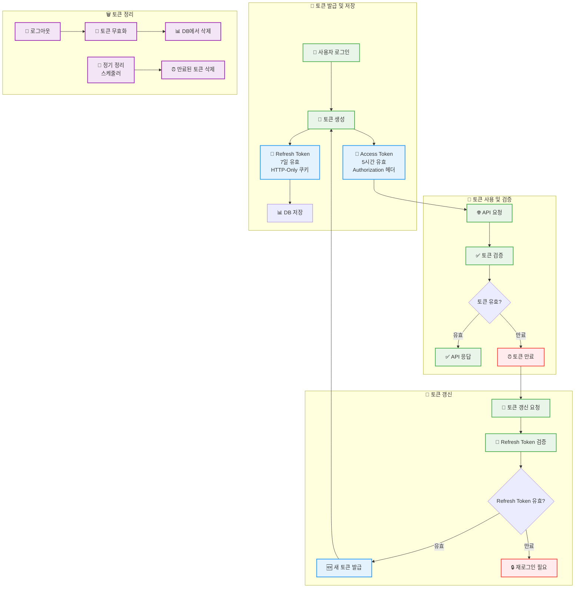
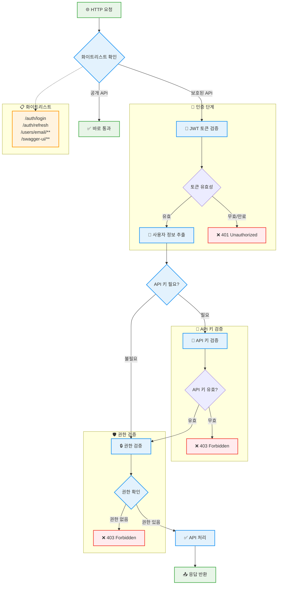

# 보안 가이드

## 목차
- [개요](#개요)
- [인증 시스템](#인증-시스템)
- [권한 관리](#권한-관리)
- [API 보안](#api-보안)
- [CORS 정책](#cors-정책)
- [보안 설정](#보안-설정)
- [보안 모범 사례](#보안-모범-사례)
- [보안 점검 목록](#보안-점검-목록)

## 개요

Vans Story Backend는 **JWT 기반 인증**과 **역할 기반 접근 제어(RBAC)**를 사용하여 포괄적인 보안을 제공합니다.

### 보안 아키텍처
```
[ 클라이언트 ] 
     ↓ (HTTPS + CORS)
[ Spring Security Filter Chain ]
     ↓ (JWT Filter)
[ Authentication & Authorization ]
     ↓ (Role-based Access Control)
[ API Endpoints ]
```

```mermaid
graph TD
    C[👤 클라이언트] --> H[🔒 HTTPS 연결]
    H --> CORS[🌐 CORS 필터]
    CORS --> SC[🛡️ Spring Security 필터 체인]
    
    subgraph "Spring Security 필터 체인"
        SC --> CF[CorsFilter]
        CF --> CSF[CsrfFilter]
        CSF --> LF[LogoutFilter]
        LF --> JWTFilter[🔑 JWT 인증 필터]
        JWTFilter --> AF[AuthorizationFilter]
        AF --> EHF[ExceptionHandlingFilter]
    end
    
    JWTFilter --> AUTH[🔐 인증 & 인가 처리]
    
    subgraph "인증 & 인가"
        AUTH --> TOKEN[JWT 토큰 검증]
        TOKEN --> USER[사용자 정보 추출]
        USER --> ROLE[역할 기반 권한 확인]
    end
    
    ROLE --> API[🚀 API 엔드포인트]
    
    subgraph "API 엔드포인트"
        API --> PUB[🌐 공개 API<br/>auth/login, auth/refresh]
        API --> USER_API[👤 사용자 API<br/>users/{id}]
        API --> ADMIN[👑 관리자 API<br/>users/]
    end
    
    classDef securityClass fill:#ffebee,stroke:#f44336,stroke-width:2px
    classDef filterClass fill:#e3f2fd,stroke:#2196f3,stroke-width:2px
    classDef authClass fill:#fff3e0,stroke:#ff9800,stroke-width:2px
    classDef apiClass fill:#e8f5e8,stroke:#4caf50,stroke-width:2px
    
    class C,H,CORS securityClass
    class SC,CF,CSF,LF,JWTFilter,AF,EHF filterClass
    class AUTH,TOKEN,USER,ROLE authClass
    class API,PUB,USER_API,ADMIN apiClass
```

### 주요 보안 기능
- **JWT 기반 인증/인가**
- **BCrypt 비밀번호 암호화**
- **API 키 인증** (내부 API)
- **CORS 정책 관리**
- **역할 기반 접근 제어**
- **세션리스 아키텍처**

---

## 인증 시스템

### JWT (JSON Web Token) 인증

#### 토큰 구조
```
Header.Payload.Signature
```

- **알고리즘**: HMAC-SHA256
- **키 관리**: Base64 인코딩된 비밀 키
- **클레임**: subject, authorities, expiration

#### 토큰 생명주기
| 토큰 타입 | 유효 기간 | 저장 위치 | 용도 |
|-----------|-----------|-----------|------|
| Access Token | 5시간 (18000초) | Authorization 헤더 | API 접근 인증 |
| Refresh Token | 7일 (604800초) | HTTP-Only 쿠키 | 토큰 갱신 |



#### 토큰 검증 프로세스
```kotlin
// 1. Authorization 헤더에서 토큰 추출
Authorization: Bearer <jwt_token>

// 2. 토큰 검증 과정
- 서명 검증 (HMAC-SHA256)
- 만료 시간 확인
- 형식 유효성 검사
- 클레임 추출

// 3. SecurityContext에 인증 정보 설정
SecurityContextHolder.getContext().authentication = authentication
```

#### 환경 변수 설정
```env
# JWT 비밀 키 (Base64 인코딩)
VANS_BLOG_JWT_SECRET_KEY=your_base64_encoded_secret_key

# 토큰 유효 기간 (초)
VANS_BLOG_JWT_ACCESS_TOKEN_VALIDITY=18000
VANS_BLOG_JWT_REFRESH_TOKEN_VALIDITY=604800
```

---

## 권한 관리

### 역할 기반 접근 제어 (RBAC)

#### 사용자 역할
```kotlin
enum class Role {
    USER,    // 일반 사용자
    ADMIN    // 관리자
}
```

#### 권한 매트릭스
| 엔드포인트 | USER | ADMIN | 비인증 |
|------------|------|-------|--------|
| `POST /auth/signup` | ❌ | ❌ | ✅ |
| `POST /auth/login` | ❌ | ❌ | ✅ |
| `POST /auth/refresh` | ✅ | ✅ | ✅ |
| `POST /auth/logout` | ✅ | ✅ | ✅ |
| `POST /users` | ❌ | ✅ | ❌ |
| `GET /users` | ❌ | ✅ | ❌ |
| `GET /users/{id}` | 본인만 | ✅ | ❌ |
| `GET /users/email/{email}` | ❌ | ❌ | ✅ |
| `PATCH /users/{id}` | 본인만 | ✅ | ❌ |
| `DELETE /users/{id}` | 본인만 | ✅ | ❌ |
| `POST /oauth/login` | ❌ | ❌ | ✅ |
| `POST /oauth/exchange` | ❌ | ❌ | ✅ |
| `POST /oauth/link` | ✅ | ✅ | ❌ |
| `DELETE /oauth/unlink` | ✅ | ✅ | ❌ |
| `GET /oauth/linked` | ✅ | ✅ | ❌ |

```mermaid
graph TD
    subgraph "👤 사용자 역할 (실제 Role Enum)"
        USER[👤 USER<br/>Role.USER<br/>(ROLE_USER)]
        ADMIN[👑 ADMIN<br/>Role.ADMIN<br/>(ROLE_ADMIN)]
    end
    
    subgraph "🌐 공개 API (비인증)"
        PUBLIC_SIGNUP[POST /auth/signup<br/>회원가입]
        PUBLIC_LOGIN[POST /auth/login<br/>로그인]
        PUBLIC_REFRESH[POST /auth/refresh<br/>토큰 갱신]
        PUBLIC_LOGOUT[POST /auth/logout<br/>로그아웃]
        PUBLIC_EMAIL[GET /users/email/{email}<br/>이메일로 닉네임 조회]
        PUBLIC_OAUTH_LOGIN[POST /oauth/login<br/>OAuth 소셜 로그인]
        PUBLIC_OAUTH_EXCHANGE[POST /oauth/exchange<br/>임시 코드 -> JWT 교환]
    end
    
    subgraph "🔐 인증 필요 API"
        AUTH_OAUTH_LINK[POST /oauth/link<br/>OAuth 계정 연결]
        AUTH_OAUTH_UNLINK[DELETE /oauth/unlink<br/>OAuth 계정 해제]
        AUTH_OAUTH_LINKED[GET /oauth/linked<br/>연결된 계정 조회]
        AUTH_USER_SELF[GET/PATCH/DELETE /users/{id}<br/>본인 정보만 접근]
    end
    
    subgraph "👑 관리자 전용 API"
        ADMIN_USER_CREATE[POST /users<br/>사용자 생성]
        ADMIN_USER_LIST[GET /users<br/>전체 사용자 조회]
        ADMIN_USER_ALL[GET/PATCH/DELETE /users/{id}<br/>모든 사용자 정보 접근]
    end
    
    USER --> AUTH_OAUTH_LINK
    USER --> AUTH_OAUTH_UNLINK
    USER --> AUTH_OAUTH_LINKED
    USER --> AUTH_USER_SELF
    
    ADMIN --> AUTH_OAUTH_LINK
    ADMIN --> AUTH_OAUTH_UNLINK
    ADMIN --> AUTH_OAUTH_LINKED
    ADMIN --> AUTH_USER_SELF
    ADMIN --> ADMIN_USER_CREATE
    ADMIN --> ADMIN_USER_LIST
    ADMIN --> ADMIN_USER_ALL
    
    subgraph "🔒 실제 권한 검증 (Spring Security)"
        RBAC["@PreAuthorize<br/>hasRole('ADMIN')<br/>or<br/>authentication.principal.id == #id"]
    end
    
    AUTH_USER_SELF --> RBAC
    ADMIN_USER_ALL --> RBAC
    
    classDef userClass fill:#e3f2fd,stroke:#2196f3,stroke-width:2px
    classDef adminClass fill:#ffebee,stroke:#f44336,stroke-width:2px
    classDef publicClass fill:#e8f5e8,stroke:#4caf50,stroke-width:2px
    classDef authClass fill:#fff3e0,stroke:#ff9800,stroke-width:2px
    classDef rbacClass fill:#f3e5f5,stroke:#9c27b0,stroke-width:2px
    
    class USER,AUTH_USER_SELF userClass
    class ADMIN,ADMIN_USER_CREATE,ADMIN_USER_LIST,ADMIN_USER_ALL adminClass
    class PUBLIC_SIGNUP,PUBLIC_LOGIN,PUBLIC_REFRESH,PUBLIC_LOGOUT,PUBLIC_EMAIL,PUBLIC_OAUTH_LOGIN,PUBLIC_OAUTH_EXCHANGE publicClass
    class AUTH_OAUTH_LINK,AUTH_OAUTH_UNLINK,AUTH_OAUTH_LINKED authClass
    class RBAC rbacClass
```

#### 권한 어노테이션
```kotlin
// 관리자만 접근 가능
@PreAuthorize("hasRole('ADMIN')")

// 본인 또는 관리자 접근 가능
@PreAuthorize("hasRole('ADMIN') or authentication.principal.id == #id")
```

---

## API 보안

### 화이트리스트 엔드포인트

인증이 필요 없는 공개 엔드포인트:

```kotlin
// 인증 관련
/api/v1/auth/login
/api/v1/auth/refresh
/api/v1/auth/logout

// 공개 사용자 API
/api/v1/users/email/**

// 문서화 및 개발 도구
/swagger-ui/**
/v3/api-docs/**
/error
```

### API 키 인증

내부 API 접근을 위한 추가 보안 계층:

#### 사용법
```kotlin
@RequireApiKey
@GetMapping("/internal/users")
fun getInternalUsers() { ... }
```

#### 환경 설정
```env
VANS_BLOG_INTERNAL_API_KEY=your_internal_api_key
```

#### 요청 헤더
```http
X-API-KEY: your_internal_api_key
```

#### 검증 프로세스
1. `@RequireApiKey` 어노테이션 감지
2. 요청 헤더에서 `X-API-KEY` 추출
3. 설정된 API 키와 비교
4. 불일치 시 `CustomException` 발생



---

## CORS 정책

### CORS 설정

#### 기본 설정
```kotlin
allowedOrigins = [환경변수로 설정]
allowedMethods = ["GET", "POST", "PUT", "PATCH", "DELETE", "OPTIONS"]
allowedHeaders = ["Authorization", "Content-Type", "Accept", "Origin", "X-Requested-With"]
exposedHeaders = ["Authorization"]
maxAge = 3600L
allowCredentials = true
```

#### 환경 변수 설정
```env
# 허용할 Origin 목록 (쉼표로 구분)
CORS_ALLOWED_ORIGINS=A,B,C
```
## 보안 설정

### Spring Security 설정

#### 실제 활성화된 필터 체인

프로젝트에서 실제로 동작하는 Spring Security 필터들입니다:

**1. CorsFilter**
- **목적**: Cross-Origin Resource Sharing 정책 적용
- **설정**: `.cors { it.configurationSource(corsConfigurationSource) }`
- **동작**: HTTP 요청 헤더를 검사하여 허용된 Origin에서 온 요청인지 확인
- **허용 Origin**: 환경변수 `CORS_ALLOWED_ORIGINS`로 관리

**2. JwtFilter (커스텀 필터)**
- **목적**: JWT 토큰 기반 인증 처리
- **위치**: UsernamePasswordAuthenticationFilter 이전에 배치
- **설정**: `.addFilterBefore(JwtFilter(jwtProvider), UsernamePasswordAuthenticationFilter::class.java)`
- **동작 과정**:
  - Authorization 헤더에서 Bearer 토큰 추출
  - JWT 토큰 유효성 검증 (서명, 만료시간, 형식)
  - 유효한 토큰인 경우 SecurityContext에 인증 정보 설정
  - 로그아웃 경로(`/api/v1/auth/logout`)는 토큰 검증 건너뜀

**3. UsernamePasswordAuthenticationFilter**
- **목적**: 폼 기반 사용자명/비밀번호 인증 처리
- **현재 역할**: JWT 기반 인증을 주로 사용하므로 실질적으로 미사용
- **유지 이유**: Spring Security 기본 필터 체인의 일부

**4. AnonymousAuthenticationFilter**
- **목적**: 인증되지 않은 사용자를 익명 사용자로 처리
- **동작**: SecurityContext에 인증 정보가 없으면 AnonymousAuthenticationToken 생성
- **권한**: `ROLE_ANONYMOUS` 부여
- **활용**: 공개 엔드포인트 접근 시 사용

**5. ExceptionTranslationFilter**
- **목적**: 보안 관련 예외 처리 및 적절한 HTTP 응답 생성
- **처리 예외**:
  - `AuthenticationException`: 401 Unauthorized 응답
  - `AccessDeniedException`: 403 Forbidden 응답
- **동작**: GlobalExceptionHandler와 연동하여 일관된 에러 응답 제공

**6. AuthorizationFilter (FilterSecurityInterceptor)**
- **목적**: 최종 권한 검사 및 접근 제어
- **설정**: `.authorizeHttpRequests { auth -> ... }`
- **검사 항목**:
  - 화이트리스트 엔드포인트 확인
  - 사용자 권한과 요청 리소스 권한 비교
  - `@PreAuthorize` 어노테이션 처리

#### 비활성화된 기능들

**CSRF 보호**
- **설정**: `.csrf { it.disable() }`
- **비활성화 이유**: REST API 특성상 불필요하며, JWT 토큰으로 대체

**세션 관리**
- **설정**: `.sessionCreationPolicy(SessionCreationPolicy.STATELESS)`
- **비활성화 이유**: JWT 기반 무상태(stateless) 인증 사용

**폼 로그인**
- **비활성화 이유**: REST API이므로 JSON 기반 로그인 사용

**HTTP Basic 인증**
- **비활성화 이유**: JWT Bearer 토큰 인증 방식 사용

#### 세션 관리
```kotlin
sessionManagement {
    sessionCreationPolicy(SessionCreationPolicy.STATELESS)
}
```

#### CSRF 보호
```kotlin
csrf { it.disable() }  // REST API이므로 비활성화
```

### 비밀번호 암호화

#### BCrypt 사용
```kotlin
@Bean
fun passwordEncoder(): PasswordEncoder = BCryptPasswordEncoder()
```

#### 암호화 강도
- **Cost Factor**: 10 (기본값)
- **솔트**: 자동 생성
- **해시 길이**: 60자

---

## 보안 모범 사례

### 1. JWT 토큰 관리

#### ✅ 권장사항
- **Access Token은 HTTP 헤더**로 전송
- **Refresh Token은 HTTP-Only 쿠키**로 저장
- **토큰 만료 시간을 적절히 설정** (Access: 5시간, Refresh: 7일)
- **토큰 갱신 시 새로운 Refresh Token 발급**

### 2. 비밀번호 보안

#### 비밀번호 정책
```kotlin
// 현재 적용된 검증 규칙
@Pattern(
    regexp = "^(?=.*[A-Za-z])(?=.*\\d)(?=.*[@$!%*#?&])[A-Za-z\\d@$!%*#?&]{8,}$",
    message = "비밀번호는 8자 이상이며, 영문자, 숫자, 특수문자를 포함해야 합니다"
)
```

- **최소 8자 이상**
- **영문자, 숫자, 특수문자 조합**
- **BCrypt로 암호화 저장**

### 3. API 보안

#### 요청 제한
- **Rate Limiting** 구현 권장
- **입력 값 검증** 철저히 수행
- **에러 메시지에서 민감한 정보 노출 금지**

#### 로깅 보안
```kotlin
// 안전한 로깅 예시
logger.info { "로그인 시도: ${email.take(3)}***" }
logger.info { "토큰 갱신: 사용자 ID ${userId}" }

```

---

## 보안 점검 목록

### 환경 설정 점검

#### ✅ 필수 환경 변수
- [ ] `VANS_BLOG_JWT_SECRET_KEY` (32자 이상 Base64)
- [ ] `VANS_BLOG_JWT_ACCESS_TOKEN_VALIDITY`
- [ ] `VANS_BLOG_JWT_REFRESH_TOKEN_VALIDITY`
- [ ] `VANS_BLOG_INTERNAL_API_KEY`
- [ ] `CORS_ALLOWED_ORIGINS`

#### ✅ 데이터베이스 보안
- [ ] 데이터베이스 연결 암호화 (SSL/TLS)
- [ ] 데이터베이스 사용자 최소 권한 원칙
- [ ] 비밀번호 BCrypt 암호화 확인

#### ✅ 네트워크 보안
- [ ] HTTPS 사용 (운영 환경)
- [ ] CORS 정책 적절히 설정
- [ ] API 키 헤더 검증 활성화

### 코드 레벨 점검

#### ✅ 인증/인가
- [ ] 모든 보호된 엔드포인트에 인증 필요
- [ ] 적절한 권한 검사 (`@PreAuthorize`)
- [ ] JWT 토큰 유효성 검증

#### ✅ 입력 검증
- [ ] 모든 입력에 `@Valid` 적용
- [ ] SQL Injection 방지 (Prepared Statement)
- [ ] XSS 방지 (입력 검증 및 출력 인코딩)

#### ✅ 예외 처리
- [ ] 민감한 정보 노출 금지
- [ ] 적절한 HTTP 상태 코드 반환
- [ ] 보안 로그 기록

### 운영 환경 점검

#### ✅ 서버 보안
- [ ] 불필요한 포트 차단
- [ ] 방화벽 설정
- [ ] 정기적인 보안 업데이트

#### ✅ 모니터링
- [ ] 보안 로그 모니터링
- [ ] 비정상적인 접근 패턴 감지
- [ ] 토큰 남용 모니터링

---

## 보안 관련 도구

### 개발 도구
- **IntelliJ IDEA Security Plugin**: 코드 보안 취약점 분석
- **OWASP Dependency Check**: 의존성 보안 검사
- **SonarQube**: 코드 품질 및 보안 분석

### 테스트 도구
```bash
# 의존성 보안 검사
./gradlew dependencyCheckAnalyze

# 코드 품질 분석
./gradlew sonarqube
```

### 보안 헤더 확인
```bash
# 응답 헤더 확인
curl -I https://your-api-domain.com/api/v1/users

# 권장 보안 헤더들
X-Content-Type-Options: nosniff
X-Frame-Options: DENY
X-XSS-Protection: 1; mode=block
Strict-Transport-Security: max-age=31536000; includeSubDomains
```

---

## 문제 해결

### 자주 발생하는 보안 이슈

#### 1. JWT 토큰 관련
```
문제: "JWT 토큰이 유효하지 않습니다"
해결: 토큰 만료 시간, 서명 키, 형식 확인
```

#### 2. CORS 오류
```
문제: "CORS policy에 의해 차단됨"
해결: CORS_ALLOWED_ORIGINS 환경 변수 확인
```

#### 3. 인증 실패
```
문제: "인증이 필요합니다"
해결: Authorization 헤더 형식 확인 (Bearer <token>)
```

---
